# ⚡ 전력 소비 AI 어시스턴트 (Electricity Consumption AI Assistant)

개인 전력 소비 시계열 데이터를 분석하고, 일별 집계 지표를 Google Cloud Firestore에 저장하며, 동적 Context Injection 및 Anti-Hallucination 가드레일이 적용된 OpenAI GPT를 통해 전력 소비 관련 지능형 대화 서비스를 제공하는 AI 웹 애플리케이션이다.

* 웹 애플리케이션 URL: [Electricity Consumption AI Assistant](https://energy-consumption-ai-assistant.vercel.app/)

---

## 📌 목차
- [📖 프로젝트 소개](#-프로젝트-소개)
- [✨ 주요 기능](#-주요-기능)
- [📁 프로젝트 구조](#-프로젝트-구조)
- [📐 아키텍처 다이어그램](#-아키텍처-다이어그램-architecture-diagram)
- [🛠️ 기술 스택](#️-기술-스택)
- [🌐 배포 URL 및 배포 가이드](#-배포-url-및-배포-가이드)
- [💻 로컬 개발 환경 실행](#-로컬-개발-환경-실행-local-setup)
- [🔐 환경 변수 가이드](#-환경-변수-가이드-environment-variables)
- [📸 실행 스크린샷](#-실행-스크린샷)

---

## 📖 프로젝트 소개

**💡Electricity Consumption AI Assistant💡**는 전력 소비 시계열 데이터를 LLM이 정확하고 효율적으로 활용하여 대화를 할 수 있도록 설계한 데이터 기반 AI 에너지 어시스턴트이다.

수천~수만 행의 전력 데이터를 LLM에 직접 전달하면 Context Window 초과, 높은 API 비용, 응답 지연, Hallucination 등의 문제가 발생할 수 있기 때문에, 서버에서 전력 데이터를 일별·요일별·기간별 통계로 사전 집계하고, 핵심 요약 정보를 LLM에 주입한다.

요약 데이터만으로 답하기 어려운 특정 날짜 및 기간의 상세 질의는 Function Calling을 통해 필요한 데이터만 조회하여 답변을 생성한다.

이를 통해 사용자는 *"가장 전력을 많이 사용한 날은 언제인가요?"*, *"주말에 전력을 더 많이 사용하나요?"*, *"최근 전력 사용량 추세는 어떤가요?"*, *"어느 달에 전력을 가장 많이 사용했나요?"* 와 같은 질문을 통해 자신의 전력 소비 패턴을 이해할 수 있다.

---

## ✨ 주요 기능

### 1. 🤖 데이터 기반 AI 챗봇 및 지능형 분석 (Context Injection & Function Calling)
* **컨텍스트 주입 (Context Injection)**: 데이터베이스의 최신 요약 지표(총 소비량, 일평균, 극값, 월별/요일별 패턴, 추세 등)를 산출하여 System Prompt에 실시간 주입함으로써, 모델이 사용자의 전력 소비 패턴을 바탕으로 답변.
* **OpenAI 도구 호출 (Function Calling)**: 요약본에 포함되지 않은 특정 단일 날짜(예: `2026-08-13`), 커스텀 기간(예: `6월 1일 ~ 6월 15일`), 또는 사용자 메모 조회가 필요한 질문에 대해 백엔드 도구(`get_energy_data_by_date`, `get_energy_data_by_period`, `get_energy_statistics`)를 선별적으로 호출하여 사실 기반의 데이터를 제공. (아래 [그림 1](#function-calling) 참고)
* **환각 방지 (Anti-Hallucination Guardrails)**: 주입된 데이터와 도구 반환값에만 의존하여 답변하며, 임의 수치 날조를 방지.

### 2. 📊 전력 데이터 관리 (CRUD & Server-side Data Aggregation)
* **시계열 원시 데이터 사전 집계**: 스마트미터의 30분 단위 인터벌 원시 데이터를 로컬 달력 기준 일별 합계(kWh)로 전처리하여 집계.
* **완전한 일별 레코드 CRUD**: 날짜별 전력 소비량(`date`, `value`) 및 메모(`memo`)를 등록, 조회, 수정, 삭제할 수 있는 직관적인 인터페이스와 API를 제공.
* **Pydantic 스키마 검증**: 날짜 정규식(`YYYY-MM-DD`), 실제 캘린더 일자 검증, 음수 소비량 차단(`ge=0.0`), 메모 길이 제한(`max_length=500`)으로 데이터 무결성을 보장.

### 3. 💬 대화 기록 관리 (Conversation History)
* **대화 세션 저장**: AI와의 질의응답 교환이 발생할 때마다 Google Cloud Firestore의 `conversations` 컬렉션에 자동 저장됨.
* **대화 불러오기 및 세션 전환**: 화면 좌측 대화 내역 사이드바를 통해 이전 상담 내역을 원클릭으로 다시 불러와 확인하고, 불필요한 대화는 삭제 가능.

### 4. 📈 시각화 및 사용자 경험 (UX & Bonus Features)
* **시계열 차트**: Chart.js를 기반으로 일별 전력 소비 추세를 확인할 수 있는 그래프 제공.
* **데이터 내보내기 (Export CSV)**: 저장된 전체 일별 전력 레코드(`date`, `consumption_kwh`, `memo`)를 CSV 파일로 다운로드.
* **다크 / 라이트 모드 지원**: 사용자 시스템 및 선호에 맞춘 테마 토글을 제공하며 `localStorage`와 연동되어 새로고침 후에도 유지.
* **모바일 및 데스크톱 반응형 UI**: 순수 Vanilla HTML5/CSS3/JavaScript(ES6)로 제작되어 브라우저에서 가볍고 빠르게 동작.

---

<div title="💡사용자가 웹 대시보드에서 질문을 입력했을 때, 백엔드(`app/services/ai_service.py`)가 OpenAI API와 통신하며 도구를 호출하는 다이어그램">

<figure>
<figure id="function-calling">

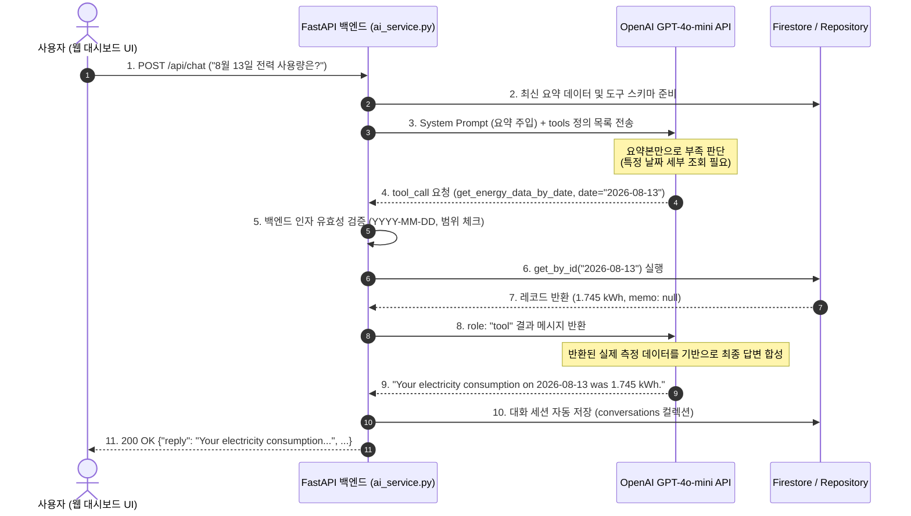

<figcaption align="center">그림 1 - Function Calling 실행 흐름</figcaption>

</figure>
</div>

---

## 📁 프로젝트 구조

```text
electricity-consumption-AI-assistant/
├── app/
│   ├── analysis/                     # 데이터 전처리 및 통계 분석 엔진
│   │   ├── preprocessor.py           # 30분 단위 시계열 → 일별 집계 파이프라인
│   │   └── summary.py                # 통계 요약 지표 산출 엔진
│   ├── core/                         # 코어 설정 및 환경 변수
│   │   └── config.py                 # Pydantic BaseSettings 환경 변수 관리
│   ├── database/                     # 데이터베이스 레이어
│   │   └── firestore.py              # Google Cloud Firestore 클라이언트 초기화
│   ├── models/                       # 데이터 및 요청/응답 스키마
│   │   ├── chat_models.py            # 대화 및 메시지 Pydantic 스키마
│   │   └── data_models.py            # 일별 전력 레코드 및 요약 응답 Pydantic 스키마
│   ├── routers/                      # FastAPI API 라우터 (엔드포인트 레이어)
│   │   ├── chat.py                   # AI 챗봇 엔드포인트 (/api/chat)
│   │   ├── conversations.py          # 대화 기록 관리 엔드포인트 (/api/conversations)
│   │   └── data.py                   # 전력 데이터 CRUD 및 요약 엔드포인트 (/api/data)
│   ├── services/                     # 비즈니스 로직 및 외부 연동 서비스
│   │   ├── ai_service.py             # OpenAI GPT 연동, 프롬프트 주입 및 Function Calling 실행
│   │   ├── conversation_service.py   # Firestore 대화 기록 저장 및 관리
│   │   └── data_service.py           # 전력 데이터 조회/등록/수정/삭제 관리
│   └── main.py                       # FastAPI 애플리케이션 진입점, CORS 및 미들웨어 설정
├── data/
│   ├── raw/                          # 30분 단위 원시 CSV 데이터셋
│   │   └── energy_raw.csv
│   └── processed/                    # 일별 집계 완료된 베이스라인 CSV 데이터셋
│       └── daily_energy.csv
├── frontend/                         # 바닐라 프론트엔드 (Vercel 배포)
│   ├── api.js                        # 서버와 통신 담당, 백엔드 연동 비동기 fetch API 클라이언트 모듈
│   ├── app.js                        # 화면(UI) 제어, 상태 관리, Chart.js 렌더링, 모달 제어, 사용자 클릭 반응
│   ├── config.js                     # 백엔드 API BASE URL 전역 런타임 설정
│   ├── index.html                    # 대시보드 단일 페이지 구조 (SPA)
│   └── style.css                     # 스타일시트 (다크/라이트 테마 변수, 반응형 레이아웃)
├── images/                           # README 및 문서용 UI 스크린샷 이미지
├── .env.example                      # 환경 변수 예시 템플릿
├── .gitignore                        # Git 추적 제외 설정
├── render.yaml                       # Render 클라우드 백엔드 Web Service 배포 상세 설정 파일 (Manifest)
├── requirements.txt                  # 파이썬 런타임 의존성 패키지 목록
└── vercel.json                       # Vercel 정적 사이트 프론트엔드 라우팅 및 빌드 설정
```

> FastAPI 프로젝트는 API 요청을 처리하는 **Router**, 실제 비즈니스 로직을 담당하는 **Service**, 데이터 저장 및 조회를 담당하는 **Repository/Database Layer**로 역할을 분리함. Router에는 HTTP 요청과 응답 처리만 두고, 전력 사용량 분석이나 데이터 처리와 같은 핵심 로직은 Service에서 담당하도록 구성함. 이를 통해 각 기능의 책임을 명확하게 하고 코드의 재사용성과 유지보수성을 높임. 또한 특정 데이터베이스나 외부 API가 변경되더라도 다른 계층에 미치는 영향을 최소화할 수 있도록 설계.

---

<details>
<summary>[프로그램 흐름도]</summary>
<br>

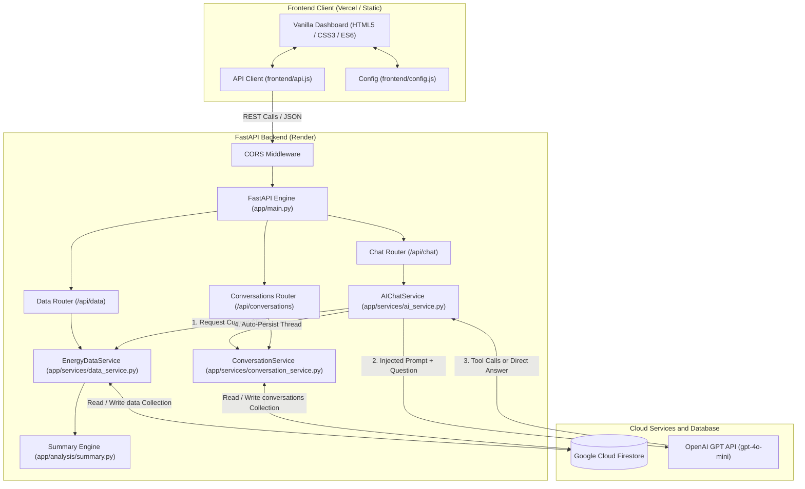

<br>
</details>

---

<details>
<summary>[데이터 파이프라인 및 모델]</summary>
<br>

### 1. 시계열 원시 데이터셋

스마트미터에서 30분 간격으로 기록된 전력 측정 데이터이다:
- **저장 위치**: `data/raw/energy_raw.csv`
- **데이터 기간**: `2026-03-01` - `2026-08-31` (또는 신규 추가된 레코드에 따라 확장)
- **기본 수집 기간**: 184일 연속 캘린더 일자 (2026년 3월부터 8월까지 6개월간)
- **기본 일별 레코드**: 8,832개 30분 단위 인터벌에서 집계된 184개 일별 레코드
- **주요 필드**:
  - `start` & `end` (timestamp): UTC ISO Datetime 문자열 (예: `2026-03-01T00:30:00Z`)
  - `consumption_kwh`: 해당 30분 구간 동안 실제 소비된 전력량 (kWh)

> **Data Semantics**: 원시 데이터의 `consumption_kwh`는 해당 30분 간격 동안 소비된 **에너지 총량**이다. 일별 전력 소비량은 동일한 날짜에 속한 48개 구간 값을 **단순 합산(Sum)**하여 계산하며, 0.5를 곱하지 않는다.

### 2. 30분 단위 → 일별 집계 파이프라인 (Data Aggregation)

[`app/analysis/preprocessor.py`](app/analysis/preprocessor.py) 모듈의 전처리 과정:
1. 타임스탬프를 파싱하여 로컬 캘린더 날짜(`YYYY-MM-DD`)로 매핑.
2. 캘린더 일자당 48개(30분 × 48 = 24시간)의 인터벌이 완전하게 존재하는지 검증.
3. 30분 간 전력량 48개를 합산하여 일별 총 전력량 계산.  
4. 전처리된 데이터를 `data/processed/daily_energy.csv`로 저장하여 초기 로컬 캐시 및 베이스라인으로 활용.

### 3. 데이터 유효성 검증 (Data Validation)

[`app/models/data_models.py`](app/models/data_models.py)에 정의된 Pydantic 검증 규칙:
- **Date Format**: 정규식 `^\d{4}-\d{2}-\d{2}$` 패턴 매칭 및 `datetime.strptime(v, "%Y-%m-%d")`를 통한 유효 캘린더 일자 검증 (예: `2026-02-30` 차단).
- **Value**: 전력 소비량은 음수일 수 없으므로 `ge=0.0` 필수 적용.
- **Memo**: 사용자 메모는 최대 500자로 제한 (`max_length=500`).
- **Payload Safety**: 스키마에 정의되지 않은 비정상 필드 주입 차단.

### 4. 일별 데이터 모델 (Daily Data Model)

[`app/models/data_models.py`](app/models/data_models.py)의 주요 Pydantic 스키마:

```python
class DailyEnergyRecord(BaseModel):
    id: str = Field(..., description="Document ID (날짜 YYYY-MM-DD와 일치)")
    date: str = Field(..., description="YYYY-MM-DD 형식의 캘린더 날짜")
    value: float = Field(..., ge=0.0, description="일별 전력 소비량 (kWh)")
    memo: Optional[str] = Field(default=None, max_length=500, description="사용자 메모")
    estimated_cost_pence: Optional[float] = None
    estimated_cost_pounds: Optional[float] = None
    standing_charge_pence: Optional[float] = None
    created_at: Optional[str] = None
    updated_at: Optional[str] = None
```

### 5. 전력 분석 요약 엔진 (Energy Analysis Summary)

[`app/analysis/summary.py`](app/analysis/summary.py) 모듈에서 산출하는 10개 핵심 통계 차원:
1. **기간 지표 (Period Metrics)**: 시작일, 종료일, 총 일수.
2. **데이터 커버리지 (Coverage)**: 결측 없는 완전 일자 수.
3. **전체 통계 (Overall Statistics)**: 총 소비량, 일평균, 중앙값, 표준편차.
4. **극값 지표 (Extremes)**:
   - 최대 소비일 예: `2026-03-16` (월요일) — 12.21 kWh
   - 최소 소비일 예: `2026-04-11` (토요일) — 1.44 kWh
5. **월별 통계 (Monthly Statistics)**: 월별 총량 및 일평균 (3월 최고: 232.63 kWh).
6. **평일 vs 주말 비교 (Weekday vs Weekend)**: 평일 평균 대비 주말 사용 패턴 분석.
7. **요일별 평균 (Day-of-Week Averages)**: 월요일부터 일요일까지의 일평균 소비량.
8. **최근 이동 윈도우 (Recent Windows)**: 최근 7일 및 30일 이동 평균과 전체 평균 비교.
9. **추세 분석 (Trend Analysis)**: 단기 추세 증감률(%) 및 장기 선형 회귀 기울기(linear slope).
10. **추정 비용 (Estimated Cost)**: 총 추정 비용 (£246.01), 일평균 비용 (£1.34/day) 및 공식 고지서가 아님을 알리는 안내문.

### 6. 요약 데이터의 한계 (Summary Limitations)

요약 데이터는 전반적인 패턴을 파악하는 데 효과적이지만 다음과 같은 한계가 있다:
- 전체 기간 및 월별, 극값 등 집계 통계 위주로 구성되어 있음.
- 극값(최대/최소)에 해당하지 않는 임의의 특정 날짜(예: `2026-07-15`)의 개별 사용량은 요약 JSON 본문에 포함되어 있지 않음.
- 따라서 특정 단일 날짜나 커스텀 기간에 대한 질문에는 Function Calling을 통한 세부 조회가 결합되어야 함.

### 7. 데이터 흐름 (Data Flow)

#### 1) 기본 Context Injection 흐름 (요약 정보로 충분한 경우)
```
원시 30분 데이터 → 전처리 집계 → Firestore / 로컬 스토어
→ Summary Engine → 통계 요약 JSON
→ System Prompt 주입 (Context Injection) → GPT 추론 → 사실 기반 직접 답변
```

#### 2) Function Calling 흐름 (특정 날짜 / 커스텀 기간 / 메모 질문)
```
사용자 질문 (예: "8월 12일 사용량은?", "6월 1일부터 15일까지 총 사용량은?")
→ GPT가 System Prompt 분석 후 요약 부족 판단
→ Tool Call 생성 (get_energy_data_by_date / get_energy_statistics)
→ 백엔드 검증 레이어 (날짜 형식, 유효 캘린더, 범위 검사)
→ Repository 실행 (Firestore / 로컬 스토어 조회 및 통계 산출)
→ role: "tool" 메시지로 결과 반환
→ GPT가 수치 계산 오차 없이 정확한 확정 값으로 최종 답변
```

<br>
</details>

---

<details>
<summary>[시스템 구현 및 기능 상세]</summary>
<br>

### 📋 기능 구현 현황 (Features Status)

본 프로젝트는 기본 요구사항(Core) 및 보너스 과제(Bonus)의 모든 기능을 구현하였다:

| 구분 | 기능 (Feature) | 세부 구현 내용 |
| :---: | :--- | :--- |
| **Core** | **데이터 기반 AI 대화 (Context Injection)** | 최신 요약 통계를 프롬프트에 동적 주입하여 정확하고 신뢰성 높은 질의응답 제공 |
| **Core** | **데이터 관리 (CRUD)** | 일별 전력 레코드(`date`, `value`, `memo`) 추가, 전체 조회, 개별 수정 및 삭제 완전 지원 |
| **Core** | **대화 기록 관리 (Conversations)** | 대화 세션 자동 저장, 히스토리 목록 사이드바 조회, 대화 불러오기 및 세션 삭제 지원 |
| **Core** | **배포 및 문서화** | Render(백엔드) 및 Vercel(프론트엔드) 배포, Swagger UI 자동 생성, 환경 변수 격리 |
| **Bonus** | **AI Function Calling (도구 호출)** | 3개 백엔드 도구(`get_energy_data_by_date`, `get_energy_data_by_period`, `get_energy_statistics`) 및 유효성 검증 레이어 구축 |
| **Bonus** | **통계 지표 확장** | `GET /api/data/summary`를 통해 추세, 평일/주말 비교, 요일별 패턴, 추정 비용 등 10개 분석 제공 |
| **Bonus** | **인터랙티브 시계열 차트** | Chart.js 기반 일별 전력 소비 시계열 차트 및 반응형 UI |
| **Bonus** | **데이터 내보내기 (Export CSV)** | 저장된 전체 일별 전력 레코드(`date`, `consumption_kwh`, `memo`)의 CSV 파일 다운로드 |
| **Bonus** | **다크 / 라이트 모드** | `localStorage`와 동기화되는 지속형 테마 토글 버튼 제공 |

---

### 🚀 FastAPI 엔드포인트 명세 (API Endpoints)

| 분류 | HTTP Method | 경로 (Path) | 설명 | 응답 코드 |
| :--- | :--- | :--- | :--- | :--- |
| **System** | `GET` | `/health` | 서비스 health 체크 및 환경 정보 | `200 OK` |
| | `GET` | `/` | 정적 프론트엔드 대시보드 제공 | `200 OK` |
| | `GET` | `/docs` | 대화형 Swagger UI API 문서 | `200 OK` |
| **Data CRUD** | `GET` | `/api/data` | 일별 전력 레코드 전체 목록 조회 (정렬 지원) | `200 OK` |
| | `POST` | `/api/data` | 새로운 일별 전력 데이터 등록 | `201 Created` |
| | `GET` | `/api/data/{id}` | 특정 일자(ID) 레코드 상세 조회 | `200 OK / 404` |
| | `PUT` | `/api/data/{id}` | 특정 일자 사용량(kWh) 또는 메모 수정 | `200 OK / 404` |
| | `DELETE` | `/api/data/{id}` | 특정 일자 레코드 삭제 | `200 OK / 404` |
| **Summary** | `GET` | `/api/data/summary` | 다차원 전력 통계 요약 생성 (AI 컨텍스트용) | `200 OK` |
| **AI Chat** | `POST` | `/api/chat` | 컨텍스트 주입 및 Function Calling 지원 대화 | `200 OK` |
| **Conversations**| `GET` | `/api/conversations` | 저장된 대화 세션 목록 조회 | `200 OK` |
| | `POST` | `/api/conversations` | 신규 대화 세션 생성 | `201 Created` |
| | `GET` | `/api/conversations/{id}` | 특정 대화 세션 전체 메시지 히스토리 조회 | `200 OK / 404` |
| | `DELETE` | `/api/conversations/{id}`| 특정 대화 세션 삭제 | `200 OK / 404` |


---

### 🗄️ Firestore 데이터 구조 (Firestore Structure)

Google Cloud Firestore에는 2개의 핵심 컬렉션이 유지된다:

#### 1) `data` 컬렉션
- **Document ID**: 날짜 문자열 `YYYY-MM-DD` (예: `2026-03-01`)
- **문서 필드**:
  - `id`: string (`YYYY-MM-DD`)
  - `date`: string (`YYYY-MM-DD`)
  - `value`: number (해당 일자의 총 전력 사용량, kWh)
  - `memo`: string or null (사용자 메모)
  - `estimated_cost_pence`: number (추정 비용, 펜스)
  - `estimated_cost_pounds`: number (추정 비용, 파운드)
  - `standing_charge_pence`: number (기본 요금, 펜스)
  - `created_at`: string (ISO 8601 타임스탬프)
  - `updated_at`: string or null (수정 타임스탬프)

#### 2) `conversations` 컬렉션
- **Document ID**: 대화 세션 UUID (예: `e8a3d120-7f99-4a92-b5cf-72bca5012345`)
- **문서 필드**:
  - `id`: string (대화 UUID)
  - `title`: string (대화 요약 제목 또는 첫 질문)
  - `created_at`: string (생성 타임스탬프)
  - `updated_at`: string (수정 타임스탬프)
  - `messages`: 배열 (대화 메시지 객체 리스트):
    - `role`: string (`user` | `assistant` | `system`)
    - `content`: string (메시지 본문)
    - `timestamp`: string (ISO 8601 타임스탬프)

---

### 💉 Context Injection & Anti-Hallucination 규칙

[`app/services/ai_service.py`](app/services/ai_service.py)에 구현된 프롬프트 주입 및 가드레일:
1. `POST /api/chat` 호출 시 현재 데이터베이스의 최신 요약본(`EnergyDataService.get_summary()`)을 산출한다.
2. System Prompt의 컨텍스트 섹션에 전체 통계 요약 JSON을 주입한다.
3. 다음과 같은 Anti-Hallucination 규칙을 적용하였다:
   - 주입된 요약 정보 또는 도구 호출로 반환된 데이터에만 엄격히 의존한다.
   - 존재하지 않는 수치, 날짜, 트렌드, 비용을 임의로 날조하거나 추정하지 않는다.
   - 데이터 기록 기간 외 날짜에 대해서는 데이터 부재 사실을 명확히 고지한다.
   - 전력 단위는 반드시 `kWh` 또는 `kWh/day`를 사용한다.
   - 모든 비용은 확정 고지서가 아닌 '추정 비용(Estimated Cost)'임을 명시한다.

---

### 💬 대화 기록 관리 (Conversation History)

- 사용자가 AI 어시스턴트와 메시지를 주고받을 때마다 `ConversationService.record_chat_exchange()`를 통해 세션 및 메시지가 영구 기록된다.
- 좌측 대화 히스토리 사이드바(`GET /api/conversations`)에서 이전 세션을 클릭하여 과거 대화를 이어갈 수 있다.
- 불필요한 세션은 삭제 버튼(`DELETE /api/conversations/{id}`)을 통해 간편하게 정리할 수 있다.

---

### 🖥️ 프론트엔드 대시보드 (Frontend Architecture)

빌드 도구나 프레임워크 없이 표준 HTML5, CSS3, Vanilla JavaScript (ES6)로 구축되었다:
- **구성 요소**:
  - [`frontend/index.html`](frontend/index.html): 단일 페이지 레이아웃 (대화 내역 사이드바, AI 채팅창, 핵심 통계 카드, 일별 전력 CRUD 테이블, Chart.js 시각화).
  - [`frontend/style.css`](style.css): 반응형 디자인, CSS 변수 기반 다크 모드/라이트 모드 테마, 부드러운 애니메이션.
  - [`frontend/config.js`](config.js): 클라이언트 런타임 환경 설정 (`window.API_BASE_URL`).
  - [`frontend/api.js`](frontend/api.js): `fetch` API 기반의 통합 REST API 클라이언트 모듈.
  - [`frontend/app.js`](frontend/app.js): DOM 조작, 실시간 차트 렌더링, 채팅 전송, CRUD 모달 제어.
- **가벼운 구조**: React, Vue, Next.js 등의 프레임워크나 빌드 번들러 의존성이 없음.

---

### 🛠️ Function Calling & Tool Use 상세 구조

#### 1) 핵심 원칙
- **Context Injection 우선**: 사전 계산된 요약본에 정보가 있다면 도구 호출 없이 즉시 답변하여 속도를 높이고 불필요한 토큰 소비를 방지.
- **부족한 정보에 한해 동적 호출**: 특정 일자, 커스텀 기간, 메모 상세 내용 등 요약본에 없는 구체적인 정보 요청 시에만 Function Calling을 발동.

#### 2) 도구 목록 및 역할
1. `get_energy_data_by_date`:
   - 설명: 특정 날짜의 실제 일별 전력 소비량(`date`, `consumption_kwh`, `memo`)을 조회.
   - 매개변수: `date` (`YYYY-MM-DD`, 필수)
2. `get_energy_data_by_period`:
   - 설명: 지정된 기간(시작일~종료일)의 일별 레코드 목록과 함께 사전 집계된 `total_consumption_kwh`, `average_daily_consumption_kwh`를 반환.
   - 매개변수: `start_date`, `end_date` (`YYYY-MM-DD`, 필수)
3. `get_energy_statistics`:
   - 설명: 커스텀 기간에 대한 결정론적 통계(`total_consumption_kwh`, `average_daily_consumption_kwh`, `minimum`, `maximum`, `records_count`)를 계산하여 반환. LLM이 수동으로 십진수 덧셈을 수행하다 계산 실수를 하지 않도록 파이썬 레벨에서 정밀하게 합산.
   - 매개변수: `start_date`, `end_date` (`YYYY-MM-DD`, 필수)

#### 3) 웹 앱 내부 Function Calling 실행 흐름 (Internal Tool Execution)

사용자가 웹 대시보드에서 질문을 입력했을 때, 백엔드(`app/services/ai_service.py`)가 OpenAI API와 통신하며 도구를 호출하고 결과를 검증·합성하는 다이어그램:


#### 4) 🔌 외부 멀티채널 연동 (GPT Actions 연동 가이드)
본 프로젝트의 백엔드 API는 FastAPI를 기반으로 **OpenAPI 3.1 표준 규격**을 자동 생성한다. 이를 통해 웹 대시보드뿐만 아니라 OpenAI ChatGPT의 **Custom GPTs (GPT Actions)** 와 연동하여 외부 대화 채널에서도 전력 분석 도구를 직접 HTTP로 호출할 수 있다.

* **OpenAPI Schema URL**: `https://energy-consumption-ai-assistant.onrender.com/openapi.json`
* **연동 절차 (How to Connect)**:
  1. ChatGPT → `Explore GPTs` → `+ Create` 접속
  2. `Configure` 탭 하단의 **Actions → Create new action** 선택
  3. **Import from URL**을 클릭하고 `https://energy-consumption-ai-assistant.onrender.com/openapi.json` 입력
  4. 자동으로 가져온 엔드포인트(`GET /api/data/summary`, `GET /api/data/{id}`, `GET /api/data` 등)를 확인하고 Actions 등록 완료
  5. ChatGPT 대화창에서 질문을 입력하여 외부 도구 호출 흐름을 검증

##### 외부 GPT Actions 호출 흐름 (Sequence Diagram)
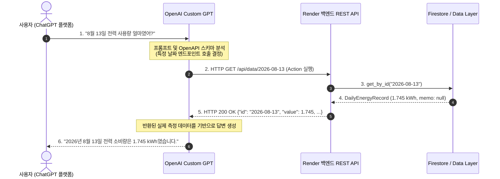

#### 5) 안전성 및 인과관계 가드레일 (Causation Guardrails)
- **클라우드 직접 접근 금지**: GPT는 Firestore나 자격 증명에 절대 직접 접근하지 않으며 항상 백엔드 서비스 레이어를 경유.
- **엄격한 파라미터 검증**: 모든 인자는 정규식, 유효 일자, 데이터 경계 체크를 통과해야 함.
- **사용자 메모와의 인과관계 주의**: "에어컨을 틀었다"는 메모가 있더라도, 전력 사용량 데이터만으로는 에어컨이 전력 증가의 유일한 원인임을 확정할 수 없음. 따라서 AI 어시스턴트는 항상 신중한 어조를 유지:
  - *"이 시기는 메모에 남겨주신 내용과 일치합니다..."*
  - *"이와 관련된 요인일 수 있습니다..."*
  - *"가구 전체 전력 데이터만으로는 특정 가전제품이 소비량 증가의 직접적인 원인이라고 단정할 수는 없습니다."*

<br>
</details>

---

## 🛠️ 기술 스택

| 분류 (Category) | 기술 및 라이브러리 | 적용 목적 및 상세 내용 |
| :--- | :--- | :--- |
| **Backend Framework** | **FastAPI** (`0.110+`) | 고성능 비동기 Python 웹 프레임워크, 엔드포인트 자동 문서화 및 의존성 주입 |
| **ASGI Web Server** | **Uvicorn** (`0.28+`) | 경량·초고속 비동기 ASGI 서버, 프로덕션 환경 구동 및 로컬 개발용 핫 리로드 지원 |
| **Validation / Settings** | **Pydantic v2 & Pydantic-Settings** | 강력한 타입 힌팅 기반 데이터 유효성 검증, 데이터 직렬화 및 환경 변수(`.env`) 안전 관리 |
| **AI / LLM Integration** | **OpenAI API** (`gpt-4o-mini`, `openai 1.14+`) | Dynamic Context Injection 및 Function Calling 기반 전력 데이터 분석 AI 어시스턴트 |
| **Database** | **Google Cloud Firestore** (`firebase-admin 6.5+`) | 서버리스 NoSQL NoSQL 클라우드 데이터베이스 (일별 전력 레코드 및 대화 히스토리 영구 저장) |
| **Data Analysis** | **Pandas** (`2.2+`) | 30분 단위 시계열 데이터 전처리, 일별 집계 및 다차원 통계 엔진 구현 |
| **Frontend** | **Vanilla HTML5, CSS3, ES6 JavaScript** | 프레임워크 없는 경량 단일 페이지(SPA) 대시보드, 다크/라이트 테마, Fetch API 통신 |
| **Data Visualization** | **Chart.js** (CDN) | 반응형 시계열 꺾은선 차트 시각화 (일별 전력 소비량 추세 분석) |
| **Cloud Hosting** | **Render (Backend)** / **Vercel (Frontend)** | 백엔드 Web Service 컨테이너 호스팅 및 프론트엔드 글로벌 정적 엣지 배포 |

---

## 🌐 배포 URL 및 배포 가이드

프론트엔드는 **Vercel**에 배포되어 있으며, 백엔드 API 서버는 **Render** Web Service로 배포되어 상호 연동된다.

* **Frontend (대시보드 웹 앱)**: [https://energy-consumption-ai-assistant.vercel.app](https://vercel.com) *(또는 로컬 `http://localhost:8000`)*
* **Backend API (서비스 루트)**: [https://energy-consumption-ai-assistant.onrender.com](https://energy-consumption-ai-assistant.onrender.com)
* **Swagger UI (대화형 API 문서)**: [https://energy-consumption-ai-assistant.onrender.com/docs](https://energy-consumption-ai-assistant.onrender.com/docs)
* **ReDoc (API 명세)**: [https://energy-consumption-ai-assistant.onrender.com/redoc](https://energy-consumption-ai-assistant.onrender.com/redoc)
* **Health Check**: [https://energy-consumption-ai-assistant.onrender.com/health](https://energy-consumption-ai-assistant.onrender.com/health)

> 💡 **Render 무료 티어 슬립(Cold Start) 안내**:
> Render 무료 인스턴스는 15분간 요청이 없으면 슬립 모드로 전환됨. 첫 접속 시 30~50초가량의 초기 지연(Cold Start)이 발생할 수 있으나 이후 정상적으로 작동함.

---

<details>
<summary>[배포 가이드]</summary>
<br>

먼저 Render설정 후에 Vercel에 배포하였다. 그런 다음, `https://<my-vercel-app>.vercel.app` 을 Render의 `ALLOWED_ORIGINS`에 입력하였다.

### 1) 🌐 Vercel 프론트엔드 배포 (Vercel Deployment)

[`vercel.json`](vercel.json) 설정을 통해 [Vercel](https://vercel.com)에 정적 사이트로 배포한다:
1. Vercel 대시보드에서 저장소를 Import한다.
2. Root Directory를 `frontend`로 지정하거나 기본 경로를 유지한다.
3. `frontend/config.js`의 `window.API_BASE_URL` 값을 Render 백엔드 주소로 지정한다:
   ```javascript
   window.API_BASE_URL = "https://energy-consumption-ai-assistant.onrender.com";
   ```
4. 배포 후 백엔드와의 CORS 연동 및 실시간 데이터 호출을 확인한다.

### 2) ☁️ Render 백엔드 배포 (Render Deployment)

[`render.yaml`](render.yaml) 파일이 포함되어 있어 [Render](https://render.com)에 원클릭 배포가 가능하다:
1. Render 대시보드에서 깃허브 저장소를 **Web Service**로 연결한다.
2. 주요 빌드 설정:
   - **Runtime**: Python 3
   - **Build Command**: `pip install -r requirements.txt`
   - **Start Command**: `uvicorn app.main:app --host 0.0.0.0 --port $PORT`
3. Render Dashboard → Environment에 환경 변수 등록:
   - `OPENAI_API_KEY`: 실제 발급받은 OpenAI API 키
   - `OPENAI_MODEL`: `gpt-4o-mini`
   - `FIREBASE_SERVICE_ACCOUNT_JSON`: 다운로드한 서비스 계정 JSON 전체 내용 `{...}`
   - `ALLOWED_ORIGINS`: `https://<my-vercel-app>.vercel.app`
   - `ENVIRONMENT`: `production`

### 3) 📖 Swagger UI API 문서 (Swagger UI)

FastAPI는 OpenAPI 표준 규격을 준수하여 인터랙티브 문서 페이지를 자동 생성한다:
- **Swagger UI**: `http://localhost:8000/docs`
- **ReDoc**: `http://localhost:8000/redoc`

브라우저에서 직접 CRUD 엔드포인트를 호출하고 요청/응답 스키마를 테스트할 수 있다.

<br>
</details>

---

## 💻 로컬 개발 환경 실행 (Local Setup)

```bash
git clone <repo-url>                          # 저장소 복제
cd <repo-name>

python -m venv .venv                          # 가상환경 구성
source .venv/bin/activate                     # macOS / Linux (Windows PowerShell는 .\.venv\Scripts\Activate.ps1)

pip install -r requirements.txt               # 의존성 패키지 설치
cp .env.example .env                          # 환경 변수 설정; .env 파일에 OPENAI_API_KEY 및 Firebase 설정 입력
uvicorn app.main:app --reload --port 8000     # 백엔드 서버 구동
```

위 절차를 따른 후,
- 웹 대시보드 접속: `http://localhost:8000/`
- Health 체크: `http://localhost:8000/health` (`"status":"healthy"`나오면 ok)
- Swagger API 문서: `http://localhost:8000/docs`

---

## 🔐 환경 변수 가이드 (Environment Variables)

| 환경 변수명 | 설명 | 기본값 / 예시 | 프로덕션 필수 여부 |
| :--- | :--- | :--- | :--- |
| `PORT` | 웹 서버 포트 | `8000` (Local) / `10000` (Render) | 예 (호스팅 환경 자동 지정) |
| `ENVIRONMENT` | 실행 환경 구분 | `development` / `production` | 권장 |
| `ALLOWED_ORIGINS` | CORS 허용 도메인 (쉼표 구분) | `https://<your-app>.vercel.app` | **예 (백엔드)** |
| `OPENAI_API_KEY` | OpenAI API 시크릿 키 | `sk-proj-...` | **예 (백엔드)** |
| `OPENAI_MODEL` | 적용할 GPT 모델명 | `gpt-4o-mini` | 선택 |
| `FIREBASE_SERVICE_ACCOUNT_JSON` | Firebase 서비스 계정 키 JSON 문자열 | `{"type":"service_account",...}` | **예 (Render 배포 시)** |
| `FIREBASE_CREDENTIALS_PATH` | 로컬 서비스 계정 파일 경로 | `serviceAccountKey.json` | 선택 (로컬용) |
| `API_BASE_URL` | 프론트엔드가 호출할 백엔드 주소 | `https://<app>.onrender.com` | **예 (프론트엔드)** |

> 보안 및 안전성 고려사항
> - 보안 비밀 정보(`.env`, `serviceAccountKey.json`, `*-firebase-adminsdk-*.json`)는 깃 저장소에 커밋하지 않고 `.gitignore`에 등록.
> - OpenAI API Key, Firebase 자격 증명 등 시크릿은 브라우저로 전달되지 않고 백엔드 내부에서만 격리되어 사용됨.
> - CORS 접근 제어: `ALLOWED_ORIGINS` 화이트리스트(접근/접속 허가 목록)를 지정하여 인가되지 않은 외부 도메인의 API 접근을 차단.
> - 입력값 스키마 검증: 모든 API 요청에 대해 Pydantic Validator가 타입, 유효 날짜 형식, 허용 범위를 검증.

---

## 📸 실행 스크린샷

### 전체 화면

(light mode)
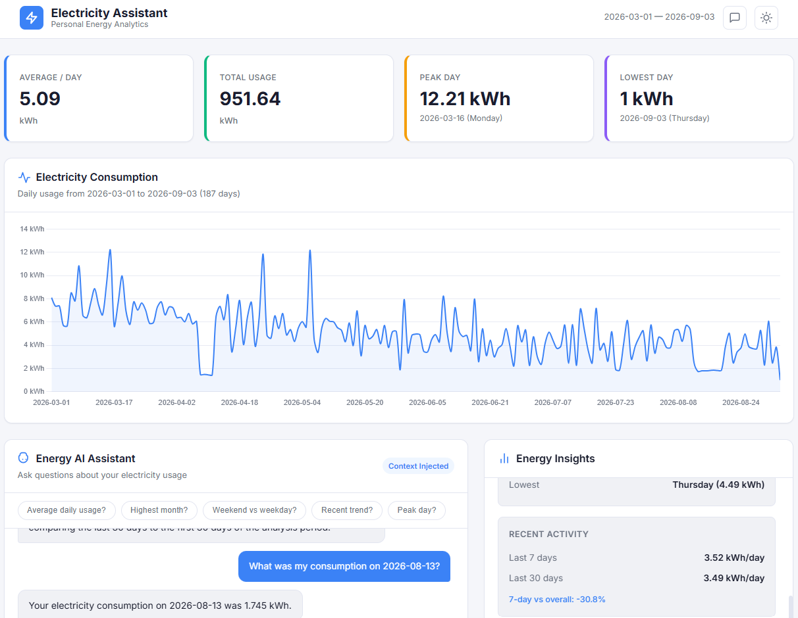

(dark mode)
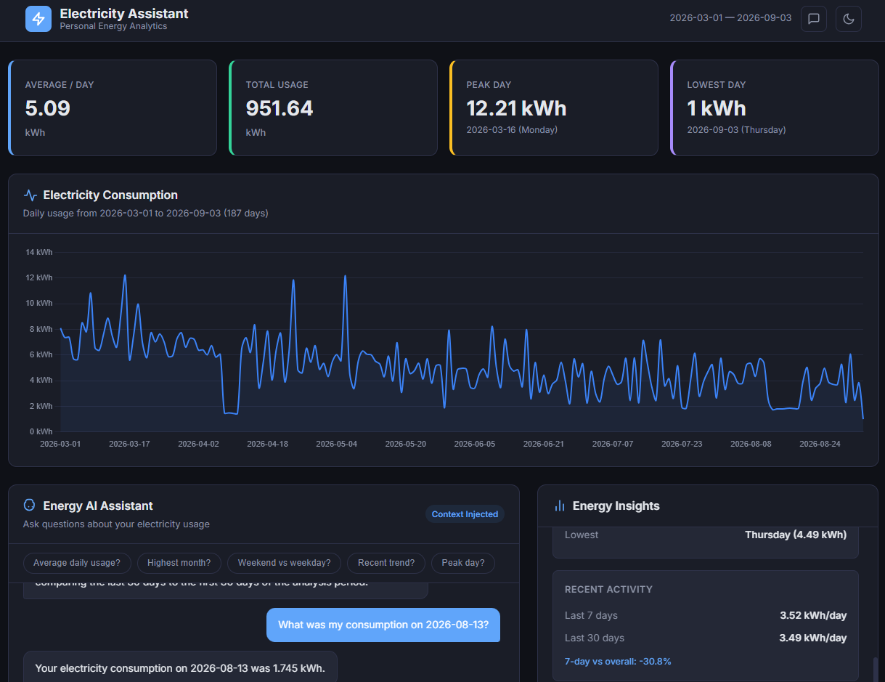

---

### 데이터 요약이 보이는 채팅 화면

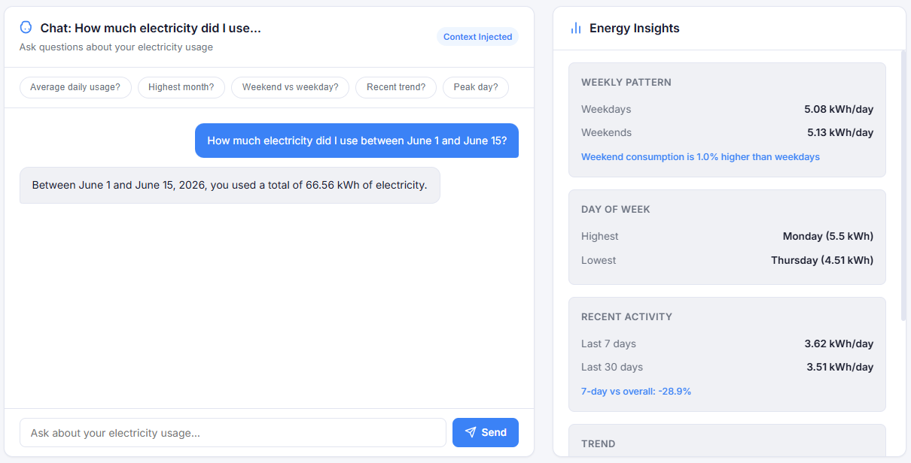


| 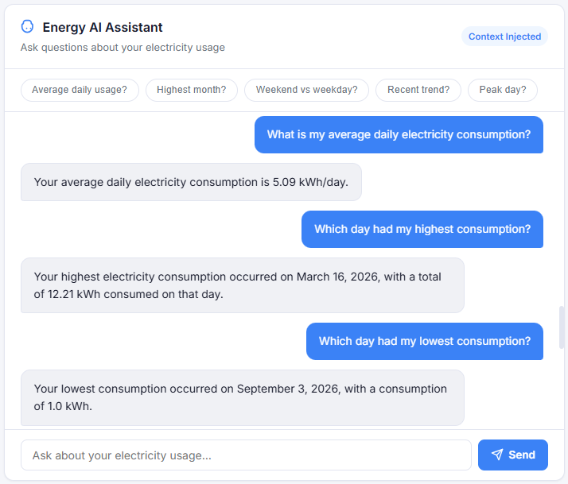 | 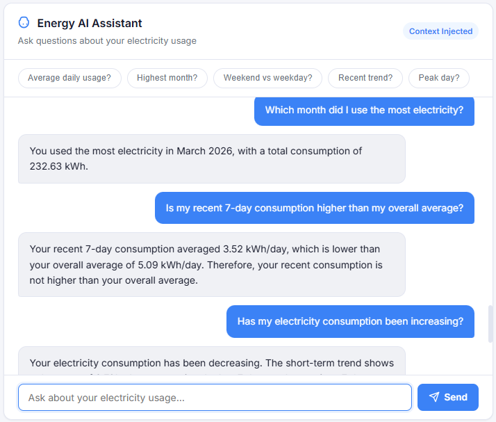 | 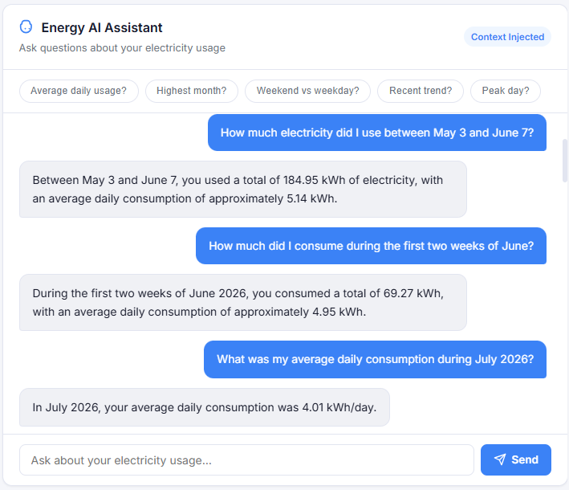 |
| :---: | :---: | :---: |

---

### 데이터 관리 화면

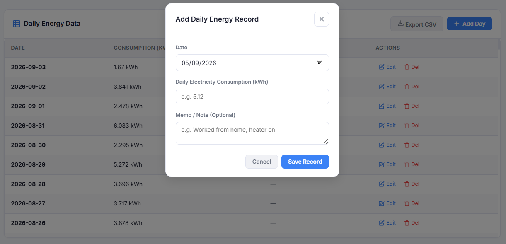

----

### 대화 기록 화면

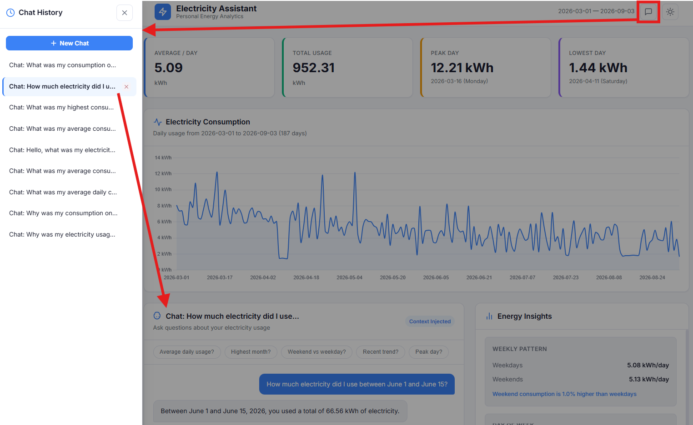

---

<details>
<summary>[Questions to AI Assistant]</summary>
<br>

AI 어시스턴트에게 꼭 물어보지 않아도 웹 화면에서 확인 가능:

1. "What is my average daily electricity consumption?"
2. "Which day had my highest consumption?"
3. "Which day had my lowest consumption?"
4. "Do I use more electricity on weekdays or weekends?"
5. "Which day of the week has the highest average consumption?"
6. "Is my recent 7-day consumption higher than my overall average?"
7. "Has my electricity consumption been increasing?"
8. "What was my electricity consumption on 2026-08-12?"

웹 화면에서 확인 불가능한 정보에 대한 질문 예시:

1. "Which month did I use the most electricity?"
2. "What was my average daily consumption during July 2026?"
3. "What was my average consumption between April 1 and May 15, 2026?"
4. "How much electricity did I use between June 1 and June 15?"
5. "How much did I consume during the first two weeks of August?"
6. "What was my highest consumption day between May 1 and June 30?"
7. "What was the lowest consumption between July 1 and July 31?"
8. "Did I use more electricity in April or May?"
9. "Compare my electricity consumption in June and July."
10. "Compare the first half of May with the second half of May."
11. "Was my consumption during August 1–15 higher than July 1–15?"
12. "How much more electricity did I use in July compared with June?"
13. "What was the percentage difference between my April and May consumption?"

<br>
</details>