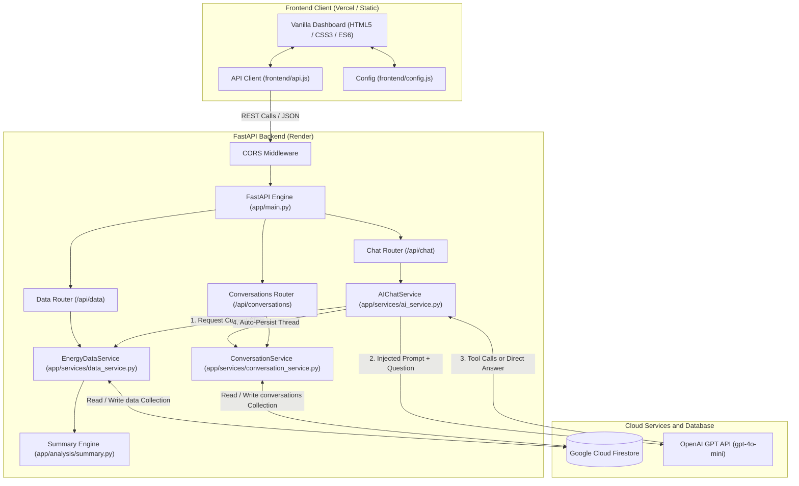

# ⚡ 전력 소비 AI 어시스턴트 (Electricity Consumption AI Assistant)

개인 전력 소비 시계열 데이터를 분석하고, 일별 집계 지표를 Google Cloud Firestore에 저장하며, 동적 Context Injection 및 Anti-Hallucination 가드레일이 적용된 OpenAI GPT를 통해 지능형 대화 서비스를 제공하는 AI-native 웹 애플리케이션이다.

---

## 📌 목차
- [📖 프로젝트 소개](#-프로젝트-소개)
- ...

---

## 📖 프로젝트 소개 (Project Introduction)

### 💡 Electricity Consumption AI Assistant

**Electricity Consumption AI Assistant**는 전력 소비 시계열 데이터를 LLM이 정확하고 효율적으로 활용할 수 있도록 설계한 데이터 기반 AI 에너지 어시스턴트이다.

수천~수만 행의 전력 데이터를 LLM에 직접 전달하면 Context Window 초과, 높은 API 비용, 응답 지연, Hallucination 등의 문제가 발생할 수 있다. 이를 해결하기 위해 서버에서 전력 데이터를 일별·요일별·기간별 통계로 사전 집계하고, 핵심 요약 정보를 LLM에 동적으로 주입한다.

또한 요약 데이터만으로 답하기 어려운 특정 날짜나 사용자 지정 기간의 상세 질의는 Function Calling을 통해 필요한 데이터만 안전하게 조회하여 정확한 답변을 생성한다.

이를 통해 사용자는 *"가장 전력을 많이 사용한 날은 언제인가요?"*, *"주말에 전력을 더 많이 사용하나요?"*, *"최근 전력 사용량 추세는 어떤가요?"*, *"어느 달에 전력을 가장 많이 사용했나요?"* 와 같은 자연어 질문을 통해 자신의 전력 소비 패턴을 쉽게 이해할 수 있다.

---

## ✨ 주요 기능

(todo: please complete this section)

* **Server-side Data Aggregation** — 대용량 원시 데이터의 효율적인 사전 집계
* **Pydantic Schema Validation** — 데이터 구조 및 타입 검증
* **Context Injection** — 통계 요약 데이터를 LLM Context에 동적으로 제공
* **Function Calling** — 상세 데이터가 필요한 질문에 대한 정확한 조회
* **Anti-Hallucination 설계** — LLM이 임의의 수치를 생성하지 않고 실제 데이터에 기반해 답변하도록 설계

특히 전력 소비 시계열 데이터는 kWh와 날짜 같은 명확한 기준, 일·요일·주말·월별 등 다양한 시간 패턴을 가지고 있어, LLM의 데이터 활용 능력과 정확성 및 Hallucination 방지 성능을 검증하기에 적합하다.

---

## 📁 프로젝트 구조

(todo)

```text
electricity-consumption-AI-assistant/
├── ...              # ...
├── ...              # ...

```

---

## 📐 아키텍처 다이어그램 (Architecture Diagram)



---

## 🛠️ 기술 스택

(todo)

---

## 🌐 배포 URL(Frontend, Backend API, Swagger)

프론트엔드는 Vercel에 배포하고 백엔드는 Render에 배포하였다.

* Frontend:
* Backend API:
* Swagger:

---

<details>
<summary>[배포 방법]</summary>
<br>

먼저 Render설정 후에 Vercel에 배포함.

### 1) 🌐 Vercel 프론트엔드 배포 (Vercel Deployment)

[`vercel.json`](vercel.json) 설정을 통해 [Vercel](https://vercel.com)에 정적 사이트로 배포한다:
1. Vercel 대시보드에서 저장소를 Import한다.
2. Root Directory를 `frontend`로 지정하거나 기본 경로를 유지한다.
3. `frontend/config.js`의 `window.API_BASE_URL` 값을 Render 백엔드 주소로 지정한다:
   ```javascript
   window.API_BASE_URL = "https://energy-consumption-ai-assistant.onrender.com";
   ```
4. 배포 후 백엔드와의 CORS 연동 및 실시간 데이터 호출을 확인한다.

### 2) ☁️ Render 백엔드 배포 (Render Deployment)

[`render.yaml`](render.yaml) 파일이 포함되어 있어 [Render](https://render.com)에 원클릭 배포가 가능하다:
1. Render 대시보드에서 깃허브 저장소를 **Web Service**로 연결한다.
2. 주요 빌드 설정:
   - **Runtime**: Python 3
   - **Build Command**: `pip install -r requirements.txt`
   - **Start Command**: `uvicorn app.main:app --host 0.0.0.0 --port $PORT`
3. Render Dashboard → Environment에 환경 변수 등록:
   - `OPENAI_API_KEY`: 실제 발급받은 OpenAI API 키
   - `OPENAI_MODEL`: `gpt-4o-mini`
   - `FIREBASE_SERVICE_ACCOUNT_JSON`: 다운로드한 서비스 계정 JSON 전체 내용 `{...}`
   - `ALLOWED_ORIGINS`: `https://<my-vercel-app>.vercel.app`
   - `ENVIRONMENT`: `production`

### 3) 📖 Swagger UI API 문서 (Swagger UI)

FastAPI는 OpenAPI 표준 규격을 준수하여 인터랙티브 문서 페이지를 자동 생성한다:
- **Swagger UI**: `http://localhost:8000/docs`
- **ReDoc**: `http://localhost:8000/redoc`

브라우저에서 직접 CRUD 엔드포인트를 호출하고 요청/응답 스키마를 테스트할 수 있다.

<br>
</details>

---

## 💻 로컬 개발 환경 실행 (Local Setup)

```bash
# 1) 저장소 복제 및 가상환경 구성
git clone <repo-url>
cd <repo-name>
python -m venv .venv

# macOS / Linux:
source .venv/bin/activate
# Windows PowerShell:
.\.venv\Scripts\Activate.ps1

# 2) 의존성 패키지 설치
pip install -r requirements.txt

# 3) 환경 변수 설정
cp .env.example .env    # .env 파일에 OPENAI_API_KEY 및 Firebase 설정을 입력.

# 4) 백엔드 서버 구동
uvicorn app.main:app --reload --port 8000
```

위 절차를 따른 후,
- 웹 대시보드 접속: `http://localhost:8000/`
- 헬스체크: `http://localhost:8000/health` (`"status":"healthy"`나오면 ok)
- Swagger API 문서: `http://localhost:8000/docs`

---

## 🔐 환경 변수 가이드 (Environment Variables)

| 환경 변수명 | 설명 | 기본값 / 예시 | 프로덕션 필수 여부 |
| :--- | :--- | :--- | :--- |
| `PORT` | 웹 서버 포트 | `8000` (Local) / `10000` (Render) | 예 (호스팅 환경 자동 지정) |
| `ENVIRONMENT` | 실행 환경 구분 | `development` / `production` | 권장 |
| `ALLOWED_ORIGINS` | CORS 허용 도메인 (쉼표 구분) | `https://<your-app>.vercel.app` | **예 (백엔드)** |
| `OPENAI_API_KEY` | OpenAI API 시크릿 키 | `sk-proj-...` | **예 (백엔드)** |
| `OPENAI_MODEL` | 적용할 GPT 모델명 | `gpt-4o-mini` | 선택 |
| `FIREBASE_SERVICE_ACCOUNT_JSON` | Firebase 서비스 계정 키 JSON 문자열 | `{"type":"service_account",...}` | **예 (Render 배포 시)** |
| `FIREBASE_CREDENTIALS_PATH` | 로컬 서비스 계정 파일 경로 | `serviceAccountKey.json` | 선택 (로컬용) |
| `API_BASE_URL` | 프론트엔드가 호출할 백엔드 주소 | `https://<app>.onrender.com` | **예 (프론트엔드)** |

> 보안 및 안전성 고려사항 (Security Considerations)
> - 보안 비밀 정보(`.env`, `serviceAccountKey.json`, `*-firebase-adminsdk-*.json`)는 깃 저장소에 커밋하지 않고 `.gitignore`에 등록.
> - OpenAI API Key, Firebase 자격 증명 등 일체의 시크릿은 브라우저로 전달되지 않고 백엔드 내부에서만 격리되어 사용됨.
> - CORS 접근 제어: `ALLOWED_ORIGINS` 화이트리스트를 지정하여 인가되지 않은 외부 도메인의 API 접근을 차단.
> - 입력값 스키마 검증: 모든 API 요청에 대해 Pydantic Validator가 타입, 유효 날짜 형식, 허용 범위를 철저히 검증.

---

<details>
<summary>[데이터]</summary>
<br>

### 시계열 원시 데이터셋

스마트미터에서 30분 간격으로 기록된 전력 측정 데이터이다:
- **저장 위치**: `data/raw/energy_raw.csv`
- **데이터 기간**: `2026-03-01` - `2026-08-31` (또는 신규 추가된 레코드에 따라 확장)
- **기본 수집 기간**: 184일 연속 캘린더 일자 (2026년 3월부터 8월까지 6개월간)
- **기본 일별 레코드**: 8,832개 30분 단위 인터벌에서 집계된 184개 일별 레코드
- **주요 필드**:
  - `start` & `end` (timestamp): UTC ISO Datetime 문자열 (예: `2026-03-01T00:30:00Z`)
  - `consumption_kwh`: 해당 30분 구간 동안 실제 소비된 전력량 (kWh)

> **Data Semantics**: 원시 데이터의 `consumption_kwh`는 해당 30분 간격 동안 소비된 **에너지 총량**이다. 일별 전력 소비량은 동일한 날짜에 속한 48개 구간 값을 **단순 합산(Sum)**하여 계산하며, 0.5를 곱하지 않는다.

### 30분 단위 → 일별 집계 파이프라인 (Data Aggregation)

[`app/analysis/preprocessor.py`](app/analysis/preprocessor.py) 모듈의 전처리 과정:
1. 타임스탬프를 파싱하여 로컬 캘린더 날짜(`YYYY-MM-DD`)로 매핑.
2. 캘린더 일자당 48개(30분 × 48 = 24시간)의 인터벌이 완전하게 존재하는지 검증.
3. 일별 총 전력량 계산:
   $$\text{Daily Consumption (kWh)} = \sum_{i=1}^{48} \text{consumption\_kwh}_i$$
4. 전처리된 데이터를 `data/processed/daily_energy.csv`로 저장하여 초기 로컬 캐시 및 베이스라인으로 활용.

### 데이터 유효성 검증 (Data Validation)

[`app/models/data_models.py`](app/models/data_models.py)에 정의된 Pydantic 검증 규칙:
- **Date Format**: 정규식 `^\d{4}-\d{2}-\d{2}$` 패턴 매칭 및 `datetime.strptime(v, "%Y-%m-%d")`를 통한 유효 캘린더 일자 검증 (예: `2026-02-30` 차단).
- **Value**: 전력 소비량은 음수일 수 없으므로 `ge=0.0` 필수 적용.
- **Memo**: 사용자 메모는 최대 500자로 제한 (`max_length=500`).
- **Payload Safety**: 스키마에 정의되지 않은 비정상 필드 주입 차단.

### 일별 데이터 모델 (Daily Data Model)

[`app/models/data_models.py`](app/models/data_models.py)의 주요 Pydantic 스키마:

```python
class DailyEnergyRecord(BaseModel):
    id: str = Field(..., description="Document ID (날짜 YYYY-MM-DD와 일치)")
    date: str = Field(..., description="YYYY-MM-DD 형식의 캘린더 날짜")
    value: float = Field(..., ge=0.0, description="일별 전력 소비량 (kWh)")
    memo: Optional[str] = Field(default=None, max_length=500, description="사용자 메모")
    estimated_cost_pence: Optional[float] = None
    estimated_cost_pounds: Optional[float] = None
    standing_charge_pence: Optional[float] = None
    created_at: Optional[str] = None
    updated_at: Optional[str] = None
```

### 전력 분석 요약 엔진 (Energy Analysis Summary)

[`app/analysis/summary.py`](app/analysis/summary.py) 모듈에서 산출하는 10개 핵심 통계 차원:
1. **기간 지표 (Period Metrics)**: 시작일, 종료일, 총 일수.
2. **데이터 커버리지 (Coverage)**: 결측 없는 완전 일자 수.
3. **전체 통계 (Overall Statistics)**: 총 소비량, 일평균, 중앙값, 표준편차.
4. **극값 지표 (Extremes)**:
   - 최대 소비일: `2026-03-16` (월요일) — 12.21 kWh
   - 최소 소비일: `2026-04-11` (토요일) — 1.44 kWh
5. **월별 통계 (Monthly Statistics)**: 월별 총량 및 일평균 (3월 최고: 232.63 kWh).
6. **평일 vs 주말 비교 (Weekday vs Weekend)**: 평일 평균 대비 주말 사용 패턴 분석.
7. **요일별 평균 (Day-of-Week Averages)**: 월요일부터 일요일까지의 일평균 소비량.
8. **최근 이동 윈도우 (Recent Windows)**: 최근 7일 및 30일 이동 평균과 전체 평균 비교.
9. **추세 분석 (Trend Analysis)**: 단기 추세 증감률(%) 및 장기 선형 회귀 기울기(linear slope).
10. **추정 비용 (Estimated Cost)**: 총 추정 비용 (£246.01), 일평균 비용 (£1.34/day) 및 공식 고지서가 아님을 알리는 안내문.

### 요약 데이터의 한계 (Summary Limitations)

요약 데이터는 전반적인 패턴을 파악하는 데 효과적이지만 다음과 같은 한계가 있다:
- 전체 기간 및 월별, 극값 등 집계 통계 위주로 구성되어 있음.
- 극값(최대/최소)에 해당하지 않는 임의의 특정 날짜(예: `2026-07-15`)의 개별 사용량은 요약 JSON 본문에 포함되어 있지 않음.
- 따라서 특정 단일 날짜나 커스텀 기간에 대한 질문에는 Function Calling을 통한 세부 조회가 결합되어야 함.

### 데이터 흐름 (Data Flow)

#### 1) 기본 Context Injection 흐름 (요약 정보로 충분한 경우)
```
원시 30분 데이터 → 전처리 집계 → Firestore / 로컬 스토어
→ Summary Engine → 통계 요약 JSON
→ System Prompt 주입 (Context Injection) → GPT 추론 → 사실 기반 직접 답변
```

#### 2) Function Calling 흐름 (특정 날짜 / 커스텀 기간 / 메모 질문)
```
사용자 질문 (예: "8월 12일 사용량은?", "6월 1일부터 15일까지 총 사용량은?")
→ GPT가 System Prompt 분석 후 요약 부족 판단
→ Tool Call 생성 (get_energy_data_by_date / get_energy_statistics)
→ 백엔드 검증 레이어 (날짜 형식, 유효 캘린더, 범위 검사)
→ Repository 실행 (Firestore / 로컬 스토어 조회 및 통계 산출)
→ role: "tool" 메시지로 결과 반환
→ GPT가 수치 계산 오차 없이 정확한 확정 값으로 최종 답변
```

<br>
</details>

---

<details>
<summary>[구현 설명]</summary>
<br>

### 기능 현황 (Features Status)

Please complete this:

| 기능 (Feature) | 세부 구현 내용 |
| :--- | :--- |
| **Function Calling / Tool Use** | 검증된 3개 백엔드 도구(`get_energy_data_by_date`, `get_energy_data_by_period`, `get_energy_statistics`) 탑재 |
| **다차원 통계 지표 확장** | `GET /api/data/summary`를 통해 추세, 평일/주말 비교, 요일별 패턴 등 10개 분석 차원 제공 |
| **인터랙티브 시각화 차트** | Chart.js 기반의 일별 시계열 전력 소비 그래프 및 반응형 UI 제공 |
| **데이터 내보내기 (Export)** | 전체 일별 전력 레코드(`date`, `consumption_kwh`, `memo`)의 원클릭 CSV 다운로드 기능 |
| **다크 모드 (Dark Mode)** | `localStorage`와 연동되는 영구 테마 토글 지원 |

### 🚀 FastAPI 엔드포인트 명세 (API Endpoints)

| 분류 | HTTP Method | 경로 (Path) | 설명 | 응답 코드 |
| :--- | :--- | :--- | :--- | :--- |
| **System** | `GET` | `/health` | 서비스 헬스체크 및 환경 정보 | `200 OK` |
| | `GET` | `/` | 정적 프론트엔드 대시보드 제공 | `200 OK` |
| | `GET` | `/docs` | 대화형 Swagger UI API 문서 | `200 OK` |
| **Data CRUD** | `GET` | `/api/data` | 일별 전력 레코드 전체 목록 조회 (정렬 지원) | `200 OK` |
| | `POST` | `/api/data` | 새로운 일별 전력 데이터 등록 | `201 Created` |
| | `GET` | `/api/data/{id}` | 특정 일자(ID) 레코드 상세 조회 | `200 OK / 404` |
| | `PUT` | `/api/data/{id}` | 특정 일자 사용량(kWh) 또는 메모 수정 | `200 OK / 404` |
| | `DELETE` | `/api/data/{id}` | 특정 일자 레코드 삭제 | `200 OK / 404` |
| **Summary** | `GET` | `/api/data/summary` | 다차원 전력 통계 요약 생성 (AI 컨텍스트용) | `200 OK` |
| **AI Chat** | `POST` | `/api/chat` | 컨텍스트 주입 및 Function Calling 지원 대화 | `200 OK` |
| **Conversations**| `GET` | `/api/conversations` | 저장된 대화 세션 목록 조회 | `200 OK` |
| | `POST` | `/api/conversations` | 신규 대화 세션 생성 | `201 Created` |
| | `GET` | `/api/conversations/{id}` | 특정 대화 세션 전체 메시지 히스토리 조회 | `200 OK / 404` |
| | `DELETE` | `/api/conversations/{id}`| 특정 대화 세션 삭제 | `200 OK / 404` |

### 🗄️ Firestore 데이터 구조 (Firestore Structure)

Google Cloud Firestore에는 2개의 핵심 컬렉션이 유지된다:

#### 1) `data` 컬렉션
- **Document ID**: 날짜 문자열 `YYYY-MM-DD` (예: `2026-03-01`)
- **문서 필드**:
  - `id`: string (`YYYY-MM-DD`)
  - `date`: string (`YYYY-MM-DD`)
  - `value`: number (해당 일자의 총 전력 사용량, kWh)
  - `memo`: string or null (사용자 메모)
  - `estimated_cost_pence`: number (추정 비용, 펜스)
  - `estimated_cost_pounds`: number (추정 비용, 파운드)
  - `standing_charge_pence`: number (기본 요금, 펜스)
  - `created_at`: string (ISO 8601 타임스탬프)
  - `updated_at`: string or null (수정 타임스탬프)

#### 2) `conversations` 컬렉션
- **Document ID**: 대화 세션 UUID (예: `e8a3d120-7f99-4a92-b5cf-72bca5012345`)
- **문서 필드**:
  - `id`: string (대화 UUID)
  - `title`: string (대화 요약 제목 또는 첫 질문)
  - `created_at`: string (생성 타임스탬프)
  - `updated_at`: string (수정 타임스탬프)
  - `messages`: 배열 (대화 메시지 객체 리스트):
    - `role`: string (`user` | `assistant` | `system`)
    - `content`: string (메시지 본문)
    - `timestamp`: string (ISO 8601 타임스탬프)

### 💉 Context Injection & Anti-Hallucination 규칙

[`app/services/ai_service.py`](app/services/ai_service.py)에 구현된 프롬프트 주입 및 가드레일:
1. `POST /api/chat` 호출 시 현재 데이터베이스의 최신 요약본(`EnergyDataService.get_summary()`)을 산출한다.
2. System Prompt의 컨텍스트 섹션에 전체 통계 요약 JSON을 주입한다.
3. 다음과 같은 Anti-Hallucination 규칙 적용:
   - 주입된 요약 정보 또는 도구 호출로 반환된 데이터에만 엄격히 의존한다.
   - 존재하지 않는 수치, 날짜, 트렌드, 비용을 임의로 날조하거나 추정하지 않는다.
   - 데이터 기록 기간 외 날짜에 대해서는 데이터 부재 사실을 명확히 고지한다.
   - 전력 단위는 반드시 `kWh` 또는 `kWh/day`를 사용한다.
   - 모든 비용은 확정 고지서가 아닌 '추정 비용(Estimated Cost)'임을 명시한다.

### 💬 대화 기록 관리 (Conversation History)

- 사용자가 AI 어시스턴트와 메시지를 주고받을 때마다 `ConversationService.record_chat_exchange()`를 통해 세션 및 메시지가 영구 기록된다.
- 좌측 대화 히스토리 사이드바(`GET /api/conversations`)에서 이전 세션을 클릭하여 과거 대화를 이어갈 수 있다.
- 불필요한 세션은 삭제 버튼(`DELETE /api/conversations/{id}`)을 통해 간편하게 정리할 수 있다.

### 🖥️ 프론트엔드 대시보드 (Frontend Architecture)

빌드 도구나 무거운 프레임워크 없이 표준 **HTML5, CSS3, Vanilla JavaScript (ES6)**로 구축되었다:
- **구성 요소**:
  - [`frontend/index.html`](frontend/index.html): 단일 페이지 레이아웃 (대화 내역 사이드바, AI 채팅창, 핵심 통계 카드, 일별 전력 CRUD 테이블, Chart.js 시각화).
  - [`frontend/style.css`](style.css): 반응형 디자인, CSS 변수 기반 다크 모드/라이트 모드 테마, 부드러운 애니메이션.
  - [`frontend/config.js`](config.js): 클라이언트 런타임 환경 설정 (`window.API_BASE_URL`).
  - [`frontend/api.js`](frontend/api.js): `fetch` API 기반의 통합 REST API 클라이언트 모듈.
  - [`frontend/app.js`](frontend/app.js): DOM 조작, 실시간 차트 렌더링, 채팅 전송, CRUD 모달 제어.
- **가벼운 구조**: React, Vue, Next.js 등의 프레임워크나 빌드 번들러 의존성이 없음.

### 🛠️ Function Calling & Tool Use 상세 구조

#### 1) 핵심 원칙
- **Context Injection 우선**: 사전 계산된 요약본에 정보가 있다면 도구 호출 없이 즉시 답변하여 속도를 높이고 불필요한 토큰 소비를 방지.
- **부족한 정보에 한해 동적 호출**: 특정 일자, 커스텀 기간, 메모 상세 내용 등 요약본에 없는 구체적인 정보 요청 시에만 Function Calling을 발동.

#### 2) 도구 목록 및 역할
1. `get_energy_data_by_date`:
   - **설명: 특정 날짜의 실제 일별 전력 소비량(`date`, `consumption_kwh`, `memo`)을 조회.
   - **매개변수: `date` (`YYYY-MM-DD`, 필수)
2. `get_energy_data_by_period`**:
   - 설명: 지정된 기간(시작일~종료일)의 일별 레코드 목록과 함께 사전 집계된 `total_consumption_kwh`, `average_daily_consumption_kwh`를 반환.
   - 매개변수: `start_date`, `end_date` (`YYYY-MM-DD`, 필수)
3. `get_energy_statistics`:
   - 설명: 커스텀 기간에 대한 결정론적 통계(`total_consumption_kwh`, `average_daily_consumption_kwh`, `minimum`, `maximum`, `records_count`)를 계산하여 반환. LLM이 수동으로 십진수 덧셈을 수행하다 계산 실수를 하지 않도록 파이썬 레벨에서 정밀하게 합산.
   - 매개변수: `start_date`, `end_date` (`YYYY-MM-DD`, 필수)

#### 3) 도구 실행 흐름
```
사용자 질문 (User Query)
  │
  ▼
OpenAI Chat Completion (도구 정의 포함 & 요약 컨텍스트 주입)
  │
  ├─► [요약으로 충분한 경우] ──► 요약 데이터 기반 직접 답변 (도구 호출 없음)
  │
  └─► [요약으로 불충분한 경우]
        │
        ▼
      GPT가 tool_call 생성 (예: get_energy_data_by_date, get_energy_statistics)
        │
        ▼
      백엔드 검증 레이어 (Backend Validation Layer)
        ├─ 포맷 검증 (YYYY-MM-DD 정규식)
        ├─ 유효 캘린더 날짜 검증
        ├─ 데이터셋 경계 검증 (2026-03-01 ~ 2026-08-31)
        └─ 기간 유효성 검증 (start_date <= end_date, 최대 조회 범위)
        │
        ▼
      서비스 / 저장소 레이어 (Firestore / 인메모리 로컬 스토어)
        │
        ▼
      실행 결과를 role: "tool" 메시지로 GPT에 반환
        │
        ▼
      GPT가 도구 데이터를 바탕으로 사실에 입각한 최종 답변 생성
```

#### 4) 안전성 및 인과관계 가드레일 (Causation Guardrails)
- **클라우드 직접 접근 금지**: GPT는 Firestore나 자격 증명에 절대 직접 접근하지 않으며 항상 백엔드 서비스 레이어를 경유.
- **엄격한 파라미터 검증**: 모든 인자는 정규식, 유효 일자, 데이터 경계 체크를 통과해야 함.
- **사용자 메모와의 인과관계 주의**: "에어컨을 틀었다"는 메모가 있더라도, 전력 사용량 데이터만으로는 에어컨이 전력 증가의 유일한 원인임을 확정할 수 없음. 따라서 AI 어시스턴트는 항상 신중한 어조를 유지:
  - *"이 시기는 메모에 남겨주신 내용과 일치합니다..."*
  - *"이와 관련된 요인일 수 있습니다..."*
  - *"가구 전체 전력 데이터만으로는 특정 가전제품이 소비량 증가의 직접적인 원인이라고 단정할 수는 없습니다."*

<br>
</details>

---

## 📸 스크린샷

### 전체 화면

(light mode)


(dark mode)


### 데이터 요약이 보이는 채팅 화면


### 데이터 관리 화면


### 대화 기록 화면

